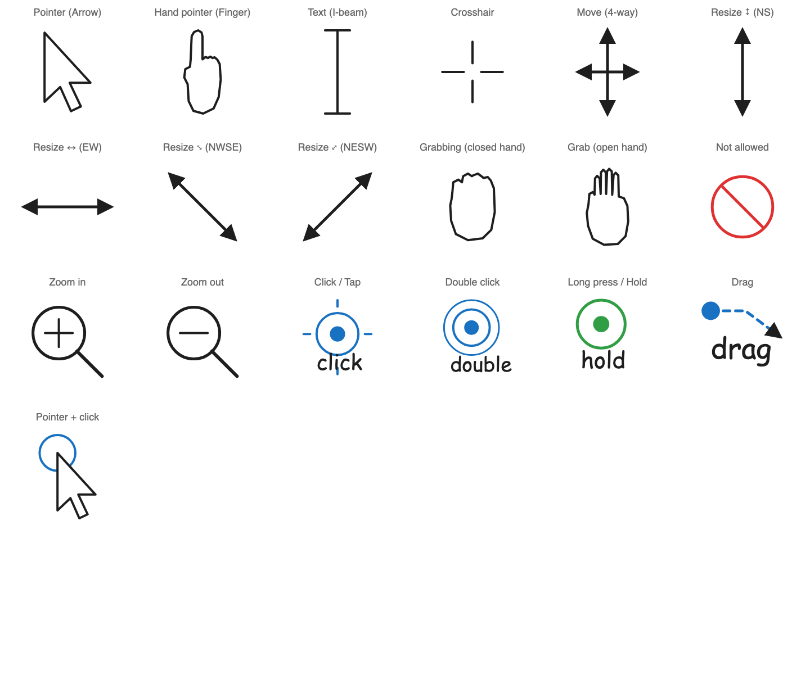

# excalidraw-libs

Open-source [Excalidraw](https://excalidraw.com) libraries. Every shape here is
original vector work, released into the public domain under
[CC0 1.0](./LICENSE) — use it anywhere, no attribution required.

## Libraries

| Library | Items | Preview |
|---|---|---|
| [**interactions**](./interactions) | 19 | Standard pointers & interaction indicators for UX / design docs |

### interactions

Standard mouse-pointer and touch-interaction items for design and interaction
explanations — the cursors you'd otherwise screenshot from an OS, drawn as clean
Excalidraw shapes you can recolor, resize and group.



**Cursors:** pointer (arrow), hand pointer (finger), text (I-beam), crosshair,
move (4-way), resize ↕ ↔ ⤡ ⤢, grab, grabbing, not-allowed, zoom in, zoom out.

**Interaction indicators:** click / tap, double click, long press / hold, drag,
pointer + click ripple.

## Using a library

1. Open [excalidraw.com](https://excalidraw.com).
2. Open the library panel (press `9` or the book icon, top-right).
3. Drag `interactions/dist/interactions.excalidrawlib` onto the panel — or use
   **Load** inside the panel.

Importing a library only adds items to your library panel; it never touches the
scene you're working on.

## Building

Shapes are generated from a single geometry source, so the `.excalidrawlib` and
the SVG/PNG preview never drift.

```bash
bun interactions/src/build.mjs
```

Outputs `interactions/dist/interactions.excalidrawlib`, `preview.svg` and
`preview.png`.

## License

[CC0 1.0 Universal](./LICENSE) — public domain dedication.
